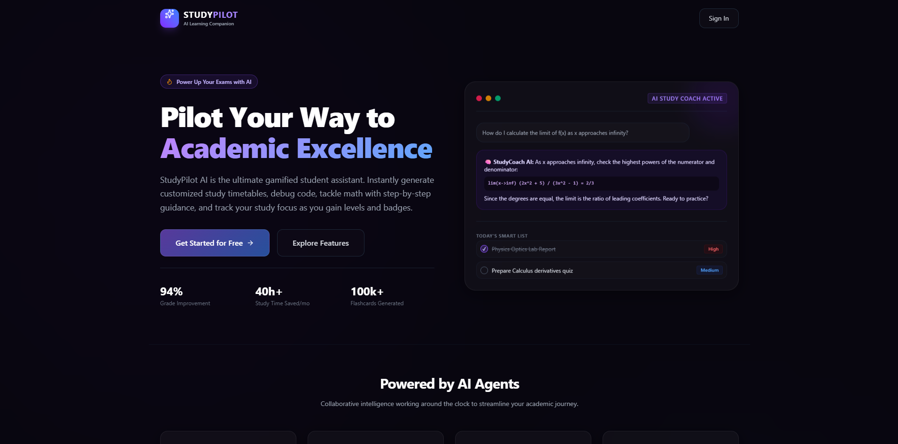
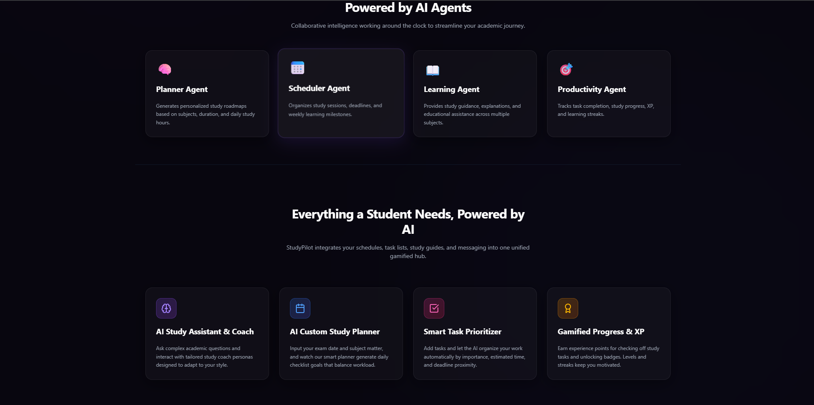
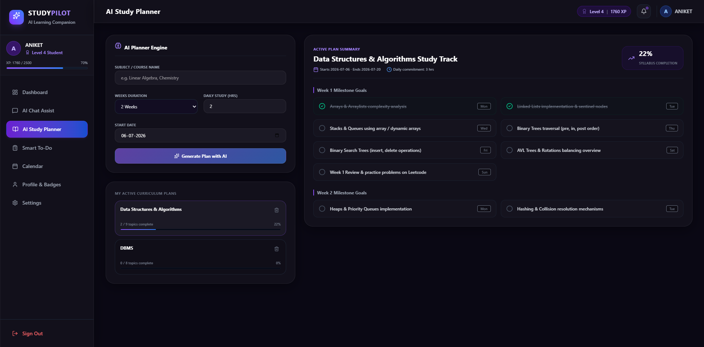
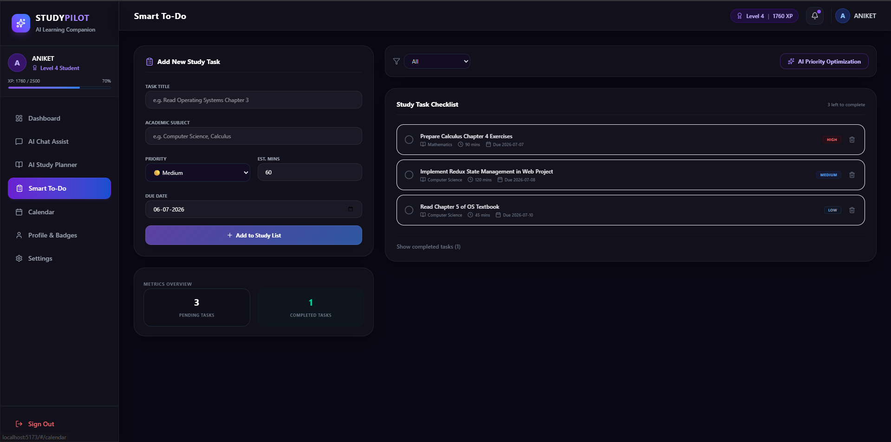
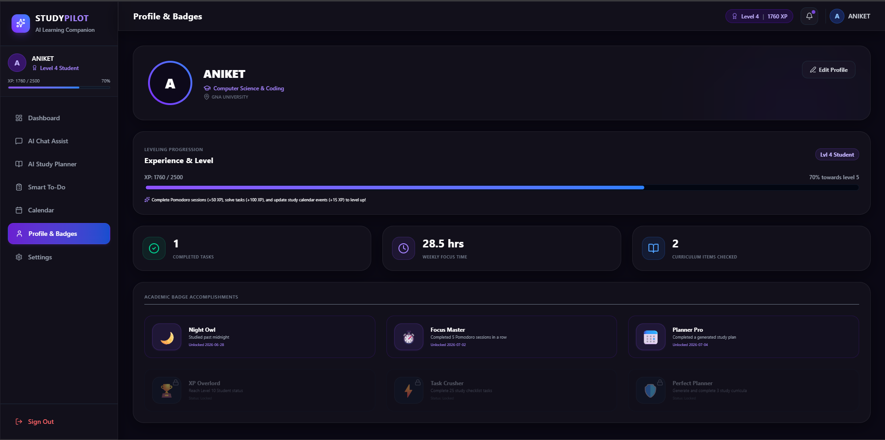
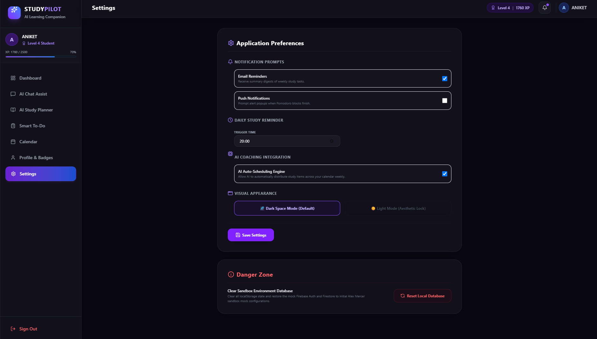

# 🚀 StudyPilot AI
### AI-Powered Learning Companion for Students


---

## 📖 Overview

StudyPilot AI is a modern AI-powered student productivity platform designed to help students organize their academic life in one place.

Instead of using multiple apps for planning, task management, calendars, study sessions, and AI assistance, StudyPilot AI combines everything into a single intelligent dashboard.

The project focuses on improving productivity through AI-generated study plans, smart scheduling, gamification, and an interactive learning assistant.

---

## ✨ Features

### 🧠 AI Study Planner
- Personalized study roadmap
- Weekly milestones
- Daily study schedule
- Progress tracking
- Multiple curriculum management

---

### 🤖 AI Chat Assistant
- Interactive AI study coach
- Multiple learning personas
- Academic question answering
- Learning guidance
- Mock AI responses (Future-ready for Gemini/OpenAI)

---

### ✅ Smart To-Do Manager

- Add study tasks
- Priority levels
- Due dates
- Completion tracking
- AI Priority Optimization

---

### 📅 Smart Calendar

- Schedule study sessions
- Monthly calendar view
- Upcoming events
- Delete confirmation popup
- Event management

---

### 📊 Student Dashboard

- Weekly study analytics
- Pomodoro timer
- AI Tips
- Study streak
- Academic level
- XP Progress

---

### 🏆 Gamification

- XP System
- Student Levels
- Achievement Badges
- Progress Tracking
- Learning Streaks

---

### 👤 Profile

- Student profile
- Badge collection
- Weekly focus statistics
- Curriculum progress

---

### ⚙️ Settings

- Theme preferences
- AI settings
- Notification settings
- Daily reminder
- Local database reset

---

## 🎯 AI Agents

StudyPilot AI is designed around multiple specialized AI Agents.

🧠 Planner Agent

Creates personalized study roadmaps.

📅 Scheduler Agent

Automatically organizes study sessions.

📖 Learning Agent

Acts as an AI Tutor for educational support.

🎯 Productivity Agent

Tracks progress, XP, badges and productivity.

---

## 🛠 Tech Stack

Frontend

- React.js
- Vite
- Tailwind CSS
- Framer Motion
- React Router

Backend

- Firebase (Planned)
- Firestore (Planned)
- Authentication (Planned)

AI

- Gemini API (Future Integration)
- OpenAI Compatible (Future Ready)

Deployment

- Vercel

Version Control

- Git & GitHub

---

# 📸 Screenshots

## Landing Page


## Landing Page 2


## Dashboard
.png)

## AI Chat


## Study Planner


## Smart To-Do


## Calendar


## Profile


## Settings


---

## 🚀 Future Improvements

- Gemini AI Integration
- Voice Assistant
- AI Notes Generator
- Flashcards
- OCR Notes Scanner
- PDF Summarizer
- Real Authentication
- Cloud Sync
- AI Revision Planner
- Mobile App
- Notifications
- Leaderboards

---

## 🧩 Project Structure

```
StudyPilot-AI/

│

├── frontend/

│ ├── src/

│ ├── components/

│ ├── pages/

│ ├── hooks/

│ ├── assets/

│ └── App.jsx

│

├── backend/

│ ├── api/

│ └── services/

│

└── README.md
```

---

## 💻 Installation

Clone Repository

```bash
git clone https://github.com/YOUR_USERNAME/StudyPilot-AI.git
```

Go into project

```bash
cd StudyPilot-AI
```

Install dependencies

```bash
npm install
```

Run locally

```bash
npm run dev
```

Build

```bash
npm run build
```

---

## 🌍 Live Demo

🔗 https://study-pilot-ai-woad.vercel.app/

---

## 🎥 Demo Video
https://youtu.be/jF7A3aobcfk

---

## 👨‍💻 Developer

**Aniket Kumar**

BCA Student | AI, Full Stack And Data Analytics Enthusiast

GitHub:
https://github.com/Aniket28-05


---

## 📜 License

This project is developed for educational purposes and Kaggle AI Capstone Submission.

---

⭐ If you like this project, don't forget to Star the repository.
